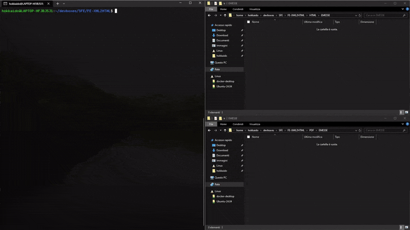

# FE-XML2HTML

Easily convert Fatture Elettroniche in XML format to HTML and PDF formats.



## Testing
See branch [0002-SHELLTEST](https://github.com/Katowicer/FE-XML2HTML/tree/0002-SHELLTEST) and setup the testing environment via the [.env](https://github.com/Katowicer/FE-XML2HTML/blob/0002-SHELLTEST/.env) file

[](https://www.jetify.com/devbox/docs/contributor-quickstart/)

<!-- gen-readme start - generated by https://github.com/jetify-com/devbox/ -->
## Development Environemt
This project uses [devbox](https://github.com/jetify-com/devbox) to manage its development environment.

Install devbox:
```sh
curl -fsSL https://get.jetpack.io/devbox | bash
```

Start the devbox shell:
```sh 
devbox shell
```

Run a script in the devbox environment:
```sh
devbox run <script>
```
## Shell Init Hook
The Shell Init Hook is a script that runs whenever the devbox environment is instantiated. It runs 
on `devbox shell` and on `devbox run`.
```sh
chmod +x ./xml2html.sh
```

## Packages

* [libxslt@1.1.42](https://www.nixhub.io/packages/libxslt)
* [wkhtmltopdf@ 0.12.6.1-3](https://www.nixhub.io/packages/wkhtmltopdf)

<!-- gen-readme end -->

## Using Docker
Use the provided [Dev Container](.devcontainer) or [Dockerfile](./Dockerfile)
See also the [.envrc](.envrc) file for [Direnv](https://direnv.net/) integration